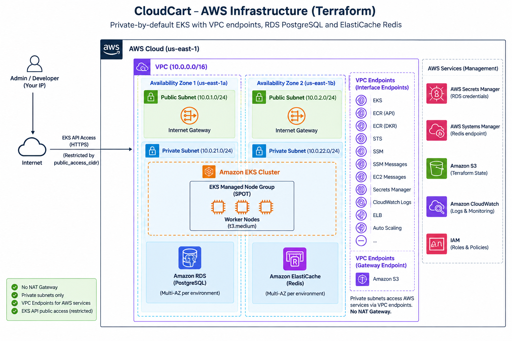

# CloudCart – AWS Infrastructure (Terraform)

Terraform configuration that provisions the AWS infrastructure for **CloudCart**: a private-by-default Amazon EKS cluster, an RDS PostgreSQL database, and an ElastiCache Redis cluster, with secrets delivered into Kubernetes via the External Secrets Operator (ESO).



## Contents

- [CloudCart – AWS Infrastructure (Terraform)](#cloudcart--aws-infrastructure-terraform)
  - [Contents](#contents)
  - [Architecture overview](#architecture-overview)
  - [Repository layout](#repository-layout)
  - [Design decisions worth knowing](#design-decisions-worth-knowing)
  - [Prerequisites](#prerequisites)
  - [Backend \& state](#backend--state)
  - [Usage](#usage)
  - [Module reference](#module-reference)
  - [Variables](#variables)
    - [`core-infra`](#core-infra)
    - [`environments/dev` and `environments/prod`](#environmentsdev-and-environmentsprod)
  - [Outputs](#outputs)
  - [Security notes](#security-notes)
  - [Cost notes](#cost-notes)

## Architecture overview

- **VPC** spanning 2 Availability Zones, each with one public and one private subnet.
- **No NAT Gateway.** Private subnets reach AWS services only through VPC endpoints (S3 gateway endpoint + interface endpoints for EKS, ECR, STS, SSM, Secrets Manager, CloudWatch Logs, ELB, Auto Scaling, etc.). Worker nodes have no route to the public internet.
- **Amazon EKS** cluster with both private and public API access; public access is restricted to an IP allow-list (`public_access_cidr`). A single managed node group (SPOT by default) runs in the private subnets.
- **EKS add-ons**: `vpc-cni`, `coredns`, `kube-proxy`, `eks-pod-identity-agent`, `aws-ebs-csi-driver`. The EBS CSI driver and External Secrets Operator authenticate to AWS using **EKS Pod Identity** (no IRSA/OIDC federation needed).
- **Amazon RDS (PostgreSQL)** and **Amazon ElastiCache (Redis)**, deployed per-environment, reachable only from the EKS worker security group.
- **Secrets**: RDS credentials + connection string are written to **Secrets Manager**; the Redis endpoint is written to **SSM Parameter Store**. The ESO IAM role (Pod Identity) can read both, scoped to the `<project_name>/*` and `/<project_name>/*` paths, so an External Secrets Operator deployment in the `external-secrets` namespace can sync them into Kubernetes `Secret` objects without any credentials living in Terraform state consumers or CI variables.
- **Two-layer Terraform design**: a shared `core-infra` layer (network/security/IAM/EKS) and thin per-environment layers (`dev`, `prod`) for the data services, connected via `terraform_remote_state`.

## Repository layout

```
terraform/
├── core-infra/                # Layer 1 – shared platform (deploy once)
│   ├── main.tf                 # wires networking, security, iam, eks modules
│   ├── variables.tf / locals.tf / providers.tf / outputs.tf
│   └── terraform.tfvars.example
│
├── environments/
│   ├── dev/                    # Layer 2 – per-environment data services
│   │   ├── main.tf              # database + cache modules
│   │   ├── data.tf              # reads core-infra remote state
│   │   ├── variables.tf / locals.tf / providers.tf
│   │   └── terraform.tfvars.example
│   └── prod/                    # identical structure to dev, separate state key
│
└── modules/
    ├── networking/   # VPC, subnets, route tables, IGW, VPC endpoints
    ├── security/     # security groups + rules for every tier
    ├── iam/           # EKS cluster/worker roles, EBS CSI + ESO Pod Identity roles
    ├── eks/           # EKS cluster, managed node group, add-ons
    ├── database/      # RDS PostgreSQL + Secrets Manager secret
    └── cache/         # ElastiCache Redis + SSM parameter
```

`core-infra` and each environment are **independent root modules** with their own state files — `core-infra` must be applied first, since `environments/*` read its outputs via a remote state data source.

## Design decisions worth knowing

| Decision | Why it matters |
|---|---|
| No NAT Gateway | Removes NAT Gateway cost and reduces the worker nodes' network exposure; all AWS API traffic goes over VPC endpoints instead. Any workload that needs to reach the public internet (e.g. pulling from a public registry that isn't ECR) will need an explicit egress path added. |
| SPOT capacity by default | Lower cost for the node group; `capacity_type` can be switched to `ON_DEMAND` per environment. |
| Pod Identity instead of IRSA | Simpler trust policy (`pods.eks.amazonaws.com`) than an OIDC provider + IRSA trust relationship, at the cost of requiring the `eks-pod-identity-agent` add-on. |
| `skip_final_snapshot` / `deletion_protection` are per-environment | Dev is optimized for fast teardown; production should set `deletion_protection = true` and `skip_final_snapshot = false`. |
| Redis `transit_encryption_enabled = false` | Traffic stays inside the private subnets and worker security group; revisit if compliance requires encryption in transit. |
| `core-infra` and `environments/*` are separate state files | Lets the platform team manage the cluster/network independently from whoever manages per-environment data services, and lets `dev`/`prod` be destroyed and rebuilt without touching the shared cluster. |

## Prerequisites

- Terraform `>= 1.5` (uses the S3 backend's native `use_lockfile` locking, available from AWS provider `~> 6.0` / recent Terraform releases — no DynamoDB lock table is used).
- An existing S3 bucket for state: `repo-1358538824-tfstate` (or update the `bucket` value in every `providers.tf` / `data.tf` to your own bucket).
- AWS credentials with permission to create VPCs, EKS, RDS, ElastiCache, IAM roles, and Secrets Manager/SSM resources.
- `kubectl` and `aws-cli` if you intend to interact with the cluster after it's created.
- Your workstation/CI runner's public IP for `public_access_cidr` (used to allow-list access to the EKS API server).

## Backend & state

Every root module (`core-infra`, `environments/dev`, `environments/prod`) uses an S3 backend with a distinct state key:

| Root module | State key |
|---|---|
| `core-infra` | `cloudcart-eks/core-infra/terraform.tfstate` |
| `environments/dev` | `cloudcart-eks/environments/dev/terraform.tfstate` |
| `environments/prod` | `cloudcart-eks/environments/prod/terraform.tfstate` |

`environments/*/data.tf` reads the `core-infra` state directly (`private_subnet_ids`, `rds_sg_id`, `redis_sg_id`) via `terraform_remote_state`, so `core-infra` must be applied — and its outputs must exist — before any environment layer is applied.

## Usage

1. **Deploy the shared platform layer:**

   ```bash
   cd terraform/core-infra
   cp terraform.tfvars.example terraform.tfvars   # edit values, especially public_access_cidr
   terraform init
   terraform plan
   terraform apply
   ```

2. **Deploy an environment's data services** (repeat per environment):

   ```bash
   cd terraform/environments/dev      # or environments/prod
   cp terraform.tfvars.example terraform.tfvars   # edit values
   terraform init
   terraform plan
   terraform apply
   ```

3. **Connect to the cluster:**

   ```bash
   aws eks update-kubeconfig --name cloudcart-eks-cluster --region <region>
   ```

4. **Tear down** in reverse order — environments first, then `core-infra` — since the environment layers depend on core-infra's outputs:

   ```bash
   cd terraform/environments/dev && terraform destroy
   cd terraform/core-infra && terraform destroy
   ```

## Module reference

| Module | Creates |
|---|---|
| `modules/networking` | VPC, public/private subnets (one pair per AZ), Internet Gateway, public/private route tables + associations, S3 gateway endpoint, interface endpoints for EKS/ECR/STS/SSM/Secrets Manager/Logs/ELB/Auto Scaling |
| `modules/security` | Security groups and ingress/egress rules for RDS, Redis, VPC endpoints, EKS control plane, and EKS worker nodes |
| `modules/iam` | EKS cluster role, EKS worker role (+ CNI/ECR-readonly/SSM policies), EBS CSI Pod Identity role, External Secrets Operator Pod Identity role + least-privilege Secrets Manager/SSM policy |
| `modules/eks` | EKS cluster, launch template + managed node group, `vpc-cni`/`coredns`/`kube-proxy`/`eks-pod-identity-agent`/`aws-ebs-csi-driver` add-ons, Pod Identity associations for EBS CSI and ESO |
| `modules/database` | RDS PostgreSQL instance, DB subnet group, parameter group, random master password, Secrets Manager secret with connection details |
| `modules/cache` | ElastiCache Redis replication group, subnet group, parameter group, SSM parameter with the Redis connection URL |

## Variables

### `core-infra`

| Name | Type | Default | Description |
|---|---|---|---|
| `project_name` | `string` | – | Prefix used for resource names/tags |
| `region` | `string` | – | AWS region (validated, e.g. `us-east-1`) |
| `vpc_cidr` | `string` | – | VPC CIDR block |
| `public_subnet_cidrs` | `list(string)` | – | One CIDR per public subnet/AZ |
| `private_subnet_cidrs` | `list(string)` | – | One CIDR per private subnet/AZ |
| `kubernetes_version` | `string` | `1.36` | EKS cluster version |
| `public_access_cidr` | `list(string)` | – | Allow-listed CIDRs for the public EKS API endpoint |
| `min_size` / `max_size` / `desired_size` | `number` | `1` / `3` / `2` | Node group scaling config |
| `instance_types` | `list(string)` | – | Node group EC2 instance types |
| `disk_size` | `number` | `20` | Worker node root volume (GiB) |
| `capacity_type` | `string` | `SPOT` | `SPOT` or `ON_DEMAND` |

### `environments/dev` and `environments/prod`

| Name | Type | Description |
|---|---|---|
| `project_name` | `string` | Must match `core-infra` |
| `environment` | `string` | `dev` or `prod` (validated) |
| `region` | `string` | AWS region |
| `db_instance_config` | `object` | `allocated_storage`, `family`, `engine`, `engine_version`, `instance_class`, `db_name`, `username`, `multi_az`, `backup_retention`, `deletion_protection`, `skip_final_snapshot` |
| `cache_config` | `object` | `engine_version`, `node_type`, `automatic_failover_enabled`, `multi_az_enabled` |

See the `terraform.tfvars.example` file in each root module for annotated example values (dev is sized for low cost; prod should be reviewed and hardened before use).

## Outputs

| Root module | Output | Description |
|---|---|---|
| `core-infra` | `private_subnet_ids` | Private subnet IDs, consumed by environment layers |
| `core-infra` | `rds_sg_id` | Security group ID for RDS, consumed by `environments/*` |
| `core-infra` | `redis_sg_id` | Security group ID for Redis, consumed by `environments/*` |
| `modules/eks` | `eks_cluster_name` | EKS cluster name |
| `modules/networking` | `vpc_id`, `public_subnet_ids`, `private_subnet_ids` | Core network identifiers |
| `modules/iam` | `eks_cluster_role_arn`, `eks_worker_role_arn`, `ebs_csi_role_arn`, `eso_role_arn` | IAM role ARNs |
| `modules/security` | `vpc_endpoint_sg_id`, `rds_sg_id`, `redis_sg_id`, `eks_cluster_sg_id`, `eks_worker_sg_id` | Security group IDs |
| `modules/cache` | `redis_endpoint` | ElastiCache primary endpoint address |

## Security notes

- RDS and ElastiCache are **not publicly accessible** and only accept traffic from the EKS worker security group.
- The EKS API server's public endpoint is restricted to `public_access_cidr` — set this to your admin/CI IP ranges, not `0.0.0.0/0`.
- EBS volumes on worker nodes are encrypted (`gp3`, `encrypted = true`), and IMDSv2 is enforced (`http_tokens = "required"`) on the node launch template.
- Database credentials are generated with `random_password` and stored only in Secrets Manager — they are never written to `terraform.tfvars`.
- The ESO IAM policy scopes `secretsmanager:GetSecretValue` and `ssm:GetParameter*` to ARNs prefixed with the project name, rather than granting account-wide read access.

## Cost notes

- No NAT Gateway (≈ $0.045/hr + data processing avoided) — traffic instead flows through VPC endpoints, some of which (interface endpoints) have their own hourly + per-GB cost, so this is a net saving mainly when egress volume is significant.
- The node group defaults to SPOT capacity; switch `capacity_type` to `ON_DEMAND` for workloads that can't tolerate interruption.
- `dev` is configured for `db.t3.micro` / `cache.t4g.micro`, single-AZ, 1-day backup retention, and `skip_final_snapshot = true` to keep teardown cheap and fast — review and increase these for `prod`.